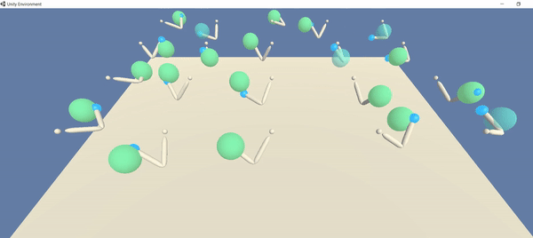
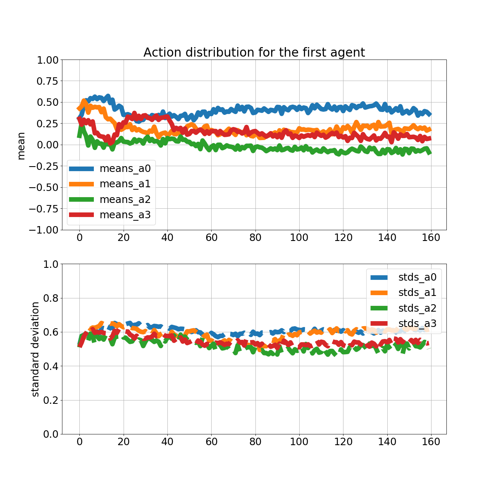

# Submission - Project 2: Continuous Control

|   | 
|:--:| 
| *GIF of my trained agent, trained in 180 episodes* |

|   | 
|:--:| 
| *Returns during training* |

### Problem Setting

**Environment**
- For this project, I had to train an agent with the [Reacher](https://github.com/Unity-Technologies/ml-agents/blob/master/docs/Learning-Environment-Examples.md#reacher) environment.

**Task**
- The task is for it to **follow the moving target** using its "hand", at the end of a **double-jointed arm**. 
- A reward of +0.1 is provided for each step that the agent's hand is in the goal location. Thus, the goal of your agent is to **maintain its position at the target location** for as many time steps as possible.
- The **observation space** consists of **33 variables** corresponding to _position_, _rotation_, _velocity_, and _angular velocities_ of the arm. 

**Challenge**
- Each **action** is a vector with **four numbers**, corresponding to *torque applicable to two joints*. Every entry in the action vector should be a number between `-1` and `1`.
- One important difficulty comes from the fact that the **action space is continuous**
- Hence methods used in [Project 1](https://github.com/chauvinSimon/deep-reinforcement-learning/blob/master/p1_navigation) cannot be used.

|   | 
|:--:| 
| *Action distribution of the first agent during training* |

### Distributed Training

For this project, two separate versions of the Unity environment are provided:
- The first version contains a **single agent**.
- The second version contains **20 identical agents**, each with **its own copy of the environment**.

The second version is useful for algorithms like [PPO](https://arxiv.org/pdf/1707.06347.pdf), [A3C](https://arxiv.org/pdf/1602.01783.pdf), and [D4PG](https://openreview.net/pdf?id=SyZipzbCb) that use **multiple** (non-interacting, parallel) **copies** of the **same agent** to distribute the task of gathering experience.  

### Solving the Environment

My project submission solves the **second version** of the environment, i.e. with 20 parallel agents. 

#### Option 1: Solve the First Version

The task is **episodic**, and in order to solve the environment, the agent must get an **average score of +30** over **100 consecutive episodes**.

#### Option 2: Solve the Second Version

The barrier for solving the second version of the environment is slightly different, to take into account the presence of many agents.  In particular, agents must get an **average score of +30** (over 100 consecutive episodes, and over all agents).  Specifically,
- After each episode, I add up the rewards that each agent received (without discounting), to get a **score for each agent**. This yields 20 (potentially different) scores. Then take the **average of these 20 scores**. 
- This yields an **average score** for each episode (where the average is over all 20 agents).

The environment is considered solved, when the **average (over 100 episodes)** of those **average scores is at least +30**. 

### Getting Started

1. Download the environment from one of the links below.  You need only select the environment that matches your operating system:

    - **_Version 1: One (1) Agent_**
        - Linux: [click here](https://s3-us-west-1.amazonaws.com/udacity-drlnd/P2/Reacher/one_agent/Reacher_Linux.zip)
        - Mac OSX: [click here](https://s3-us-west-1.amazonaws.com/udacity-drlnd/P2/Reacher/one_agent/Reacher.app.zip)
        - Windows (32-bit): [click here](https://s3-us-west-1.amazonaws.com/udacity-drlnd/P2/Reacher/one_agent/Reacher_Windows_x86.zip)
        - Windows (64-bit): [click here](https://s3-us-west-1.amazonaws.com/udacity-drlnd/P2/Reacher/one_agent/Reacher_Windows_x86_64.zip)

    - **_Version 2: Twenty (20) Agents_**
        - Linux: [click here](https://s3-us-west-1.amazonaws.com/udacity-drlnd/P2/Reacher/Reacher_Linux.zip)
        - Mac OSX: [click here](https://s3-us-west-1.amazonaws.com/udacity-drlnd/P2/Reacher/Reacher.app.zip)
        - Windows (32-bit): [click here](https://s3-us-west-1.amazonaws.com/udacity-drlnd/P2/Reacher/Reacher_Windows_x86.zip)
        - Windows (64-bit): [click here](https://s3-us-west-1.amazonaws.com/udacity-drlnd/P2/Reacher/Reacher_Windows_x86_64.zip)
    
    (_For Windows users_) Check out [this link](https://support.microsoft.com/en-us/help/827218/how-to-determine-whether-a-computer-is-running-a-32-bit-version-or-64) if you need help with determining if your computer is running a 32-bit version or 64-bit version of the Windows operating system.

    (_For AWS_) If you'd like to train the agent on AWS (and have not [enabled a virtual screen](https://github.com/Unity-Technologies/ml-agents/blob/master/docs/Training-on-Amazon-Web-Service.md)), then please use [this link](https://s3-us-west-1.amazonaws.com/udacity-drlnd/P2/Reacher/one_agent/Reacher_Linux_NoVis.zip) (version 1) or [this link](https://s3-us-west-1.amazonaws.com/udacity-drlnd/P2/Reacher/Reacher_Linux_NoVis.zip) (version 2) to obtain the "headless" version of the environment.  You will **not** be able to watch the agent without enabling a virtual screen, but you will be able to train the agent.  (_To watch the agent, you should follow the instructions to [enable a virtual screen](https://github.com/Unity-Technologies/ml-agents/blob/master/docs/Training-on-Amazon-Web-Service.md), and then download the environment for the **Linux** operating system above._)

2. Place the file in the DRLND GitHub repository, in the `p2_continuous-control/` folder, and unzip (or decompress) the file. 

### Instructions
My repository is structured as follow.
- [`main_continuous_control.ipynb`](src_submission/main_continuous_control.ipynb) is **the central file you want to use**. It contains
    - all the import statements and instructions to start the environment
    - calls to `train`
    - calls to `test`
- [`ddpg_agent.py`](src_submission/ddpg_agent.py) defines three classes
    - `Agent` with methods such as `step`, `act`, `learn` 
    - `ReplayBuffer` to store experience tuples 
	- `Ornstein-Uhlenbeck Noise` process, used when calling `agent.act()` to help convergence of the Actor
- [`model.py`](src_submission/model.py) defines the Actor and Critic Networks used by the Agent
- [`checkpoint_critic36.pth`](src_submission/checkpoint_critic36.pth) and [`checkpoint_actor36pth`](src_submission/checkpoint_actor36.pth) are the saved model weights of one of my successful agents

### Report
[`report.ipynb`](report.ipynb) describes choices and details results. It includes
- Description of the model architectures 
- Description of the hyperparameters
- Plot of Rewards
- Ideas for Future Work

The report also contains ideas for **debug** and **monitoring tools**.
- For instance, to deal with **saturation of actuators**.
- I met this failure several times while training and gives some techniques to cope with in [`report.ipynb`](report.ipynb)

|  | 
|:--:| 
| *Saturation of actuators - a failing agent constantly applying maximum torques* |

### (Optional) Challenge: Crawler Environment

I entirely focused on the **Reacher** environment. If you are interested, a second and more difficult **Crawler** environment can be addressed.

![Crawler][image2]

In this continuous control environment, the goal is to teach a creature with four legs to walk forward without falling.  

You can read more about this environment in the ML-Agents GitHub [here](https://github.com/Unity-Technologies/ml-agents/blob/master/docs/Learning-Environment-Examples.md#crawler).  To solve this harder task, you'll need to download a new Unity environment.  (**Note**: Udacity students should not submit a project with this new environment.)

You need only select the environment that matches your operating system:
- Linux: [click here](https://s3-us-west-1.amazonaws.com/udacity-drlnd/P2/Crawler/Crawler_Linux.zip)
- Mac OSX: [click here](https://s3-us-west-1.amazonaws.com/udacity-drlnd/P2/Crawler/Crawler.app.zip)
- Windows (32-bit): [click here](https://s3-us-west-1.amazonaws.com/udacity-drlnd/P2/Crawler/Crawler_Windows_x86.zip)
- Windows (64-bit): [click here](https://s3-us-west-1.amazonaws.com/udacity-drlnd/P2/Crawler/Crawler_Windows_x86_64.zip)

Then, place the file in the `p2_continuous-control/` folder in the DRLND GitHub repository, and unzip (or decompress) the file.  Next, open `Crawler.ipynb` and follow the instructions to learn how to use the Python API to control the agent.

(_For AWS_) If you'd like to train the agent on AWS (and have not [enabled a virtual screen](https://github.com/Unity-Technologies/ml-agents/blob/master/docs/Training-on-Amazon-Web-Service.md)), then please use [this link](https://s3-us-west-1.amazonaws.com/udacity-drlnd/P2/Crawler/Crawler_Linux_NoVis.zip) to obtain the "headless" version of the environment.  You will **not** be able to watch the agent without enabling a virtual screen, but you will be able to train the agent.  (_To watch the agent, you should follow the instructions to [enable a virtual screen](https://github.com/Unity-Technologies/ml-agents/blob/master/docs/Training-on-Amazon-Web-Service.md), and then download the environment for the **Linux** operating system above._)