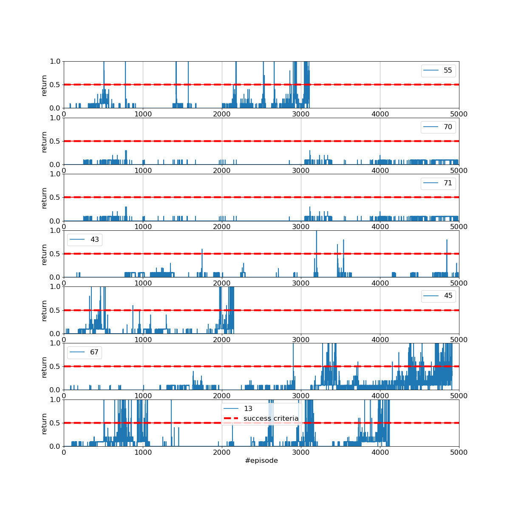

[//]: # (Image References)

[image2]: https://user-images.githubusercontent.com/10624937/42135622-e55fb586-7d12-11e8-8a54-3c31da15a90a.gif "Soccer"

# Submission - Project 3: Collaboration and Competition

|   | 
|:--:| 
| *GIF of my trained agents* |

|   | 
|:--:| 
| *Returns during training - solved in 2154 episodes* |

### Introduction

For this project, I have worked with the [Tennis](https://github.com/Unity-Technologies/ml-agents/blob/master/docs/Learning-Environment-Examples.md#tennis) environment.

**Environment**

In this environment, two agents control rackets to bounce a ball over a net. If an agent hits the ball over the net, it receives a reward of +0.1.  If an agent lets a ball hit the ground or hits the ball out of bounds, it receives a reward of -0.01.  Thus, the **goal of each agent is to keep the ball in play**. Hence it is a **collaborative** task.

The observation space consists of 8 variables corresponding to the position and velocity of the ball and racket. Each agent receives its own, local observation.  Two continuous actions are available, corresponding to movement toward (or away from) the net, and jumping. 

To **better understand the structure of the observation space**, I have implemented a function that parses the information supplied by  the environement.

Here are my findinds concerning the *positions of the rackets and the ball*:

- `y-pos-ball` is the same for `Agent1` and `Agent2`.
- `x-pos-ball` is the same except with opposite signs (I can think of it as the _signed distance to net_).

|   | 
|:--:| 
| *Trying to understand the structure of the observation state* |

For the *velocity* I am really confused:

- I noticed that `vel-ball == vel-agent`, for both `x` and `y`.
- This applies all the time, no matter if the agent is static or not.
    
I have then investigated the transtions, i.e. the impact of actions on the state.

- The subsequent table shows the transitions `S-A-S'-A'-S''`.
- I first notice the presence of saturation (you cannot go above `vel=+/-30`).
- Then, if the action is positive, one could expect it will increase the corresponding *velocity field*. This happens some times. But not always.
- This makes me think that `racket velocities` are actually *relative to the ball*.
- It would explain the *non-monotone transitions* and justify `racket-vel == ball-vel`.
- Another important consequence would be that we could *ignore 2 of the 8 elements of each state*.

|   | 
|:--:| 
| *Trying to understand the transitions* |

**Task**

The task is episodic, and in order to solve the environment, agents must get an average score of +0.5 (over 100 consecutive episodes, after taking the maximum over both agents). Specifically,

- After each episode, we add up the rewards that each agent received (without discounting), to get a score for each agent. This yields 2 (potentially different) scores. We then take the maximum of these 2 scores.
- This yields a single **score** for each episode.

The environment is considered solved, when the average (over 100 episodes) of those **scores** is at least +0.5.

### Getting Started

1. Download the environment from one of the links below.  You need only select the environment that matches your operating system:
    - Linux: [click here](https://s3-us-west-1.amazonaws.com/udacity-drlnd/P3/Tennis/Tennis_Linux.zip)
    - Mac OSX: [click here](https://s3-us-west-1.amazonaws.com/udacity-drlnd/P3/Tennis/Tennis.app.zip)
    - Windows (32-bit): [click here](https://s3-us-west-1.amazonaws.com/udacity-drlnd/P3/Tennis/Tennis_Windows_x86.zip)
    - Windows (64-bit): [click here](https://s3-us-west-1.amazonaws.com/udacity-drlnd/P3/Tennis/Tennis_Windows_x86_64.zip)
    
    (_For Windows users_) Check out [this link](https://support.microsoft.com/en-us/help/827218/how-to-determine-whether-a-computer-is-running-a-32-bit-version-or-64) if you need help with determining if your computer is running a 32-bit version or 64-bit version of the Windows operating system.

    (_For AWS_) If you'd like to train the agent on AWS (and have not [enabled a virtual screen](https://github.com/Unity-Technologies/ml-agents/blob/master/docs/Training-on-Amazon-Web-Service.md)), then please use [this link](https://s3-us-west-1.amazonaws.com/udacity-drlnd/P3/Tennis/Tennis_Linux_NoVis.zip) to obtain the "headless" version of the environment.  You will **not** be able to watch the agent without enabling a virtual screen, but you will be able to train the agent.  (_To watch the agent, you should follow the instructions to [enable a virtual screen](https://github.com/Unity-Technologies/ml-agents/blob/master/docs/Training-on-Amazon-Web-Service.md), and then download the environment for the **Linux** operating system above._)

2. Place the file in the DRLND GitHub repository, in the `p3_collab-compet/` folder, and unzip (or decompress) the file. 

### Instructions

My repository is structured as follow.

- [`main_collab_compet.ipynb`](https://github.com/chauvinSimon/deep-reinforcement-learning/blob/master/p3_collab-compet/src_submission/main_collab_compet.ipynb) is **the central file you want to use**. It contains
    - all the import statements and instructions to start the environment
    - calls to `train`
    - calls to `test`
- [`ddpg_agent.py`](https://github.com/chauvinSimon/deep-reinforcement-learning/blob/master/p3_collab-compet/src_submission/ddpg_agent.py) defines three classes
    - `Agent` with methods such as `step`, `act`, `learn` 
    - `ReplayBuffer` to store experience tuples 
	- `Ornstein-Uhlenbeck Noise` process, used when calling `agent.act()` to help convergence of the Actor
- [`model.py`](https://github.com/chauvinSimon/deep-reinforcement-learning/blob/master/p3_collab-compet/src_submission/model.py) defines the Actor and Critic Networks used by the Agent
- [`checkpoint_actor_x67success.pth`](https://github.com/chauvinSimon/deep-reinforcement-learning/blob/master/p3_collab-compet/src_submission/checkpoints/checkpoint_actor_x67success.pth) and [`checkpoint_critic_x67success.pth`](https://github.com/chauvinSimon/deep-reinforcement-learning/blob/master/p3_collab-compet/src_submission/checkpoints/checkpoint_critic_x67success.pth) are the saved model weights of one of my successful agents.

### Report
[`report.ipynb`](report.ipynb) describes choices and details results. It includes
- Description of the model architectures 
- Description of the hyperparameters
- Plot of Rewards
- Ideas for Future Work

I also present the results obtained on **different seeds**.

|   | 
|:--:| 
| *Impact of seed- detailed in my report* |

In addition, I introduce **tools to monitor** the training phase, for instance the action distribution of each agent.

|   | 
|:--:| 
| *Actions distribution - detailed in my report* |

### (Optional) Challenge: Crawler Environment

I entirely focused on the **Tennis** environment. If you are interested, a second and more difficult **Soccer** environment can be addressed.

![Soccer][image2]

In this environment, the goal is to train a team of agents to play soccer.  

You can read more about this environment in the ML-Agents GitHub [here](https://github.com/Unity-Technologies/ml-agents/blob/master/docs/Learning-Environment-Examples.md#soccer-twos).  To solve this harder task, you'll need to download a new Unity environment.  (**Note**: Udacity students should not submit a project with this new environment.)

You need only select the environment that matches your operating system:
- Linux: [click here](https://s3-us-west-1.amazonaws.com/udacity-drlnd/P3/Soccer/Soccer_Linux.zip)
- Mac OSX: [click here](https://s3-us-west-1.amazonaws.com/udacity-drlnd/P3/Soccer/Soccer.app.zip)
- Windows (32-bit): [click here](https://s3-us-west-1.amazonaws.com/udacity-drlnd/P3/Soccer/Soccer_Windows_x86.zip)
- Windows (64-bit): [click here](https://s3-us-west-1.amazonaws.com/udacity-drlnd/P3/Soccer/Soccer_Windows_x86_64.zip)

Then, place the file in the `p3_collab-compet/` folder in the DRLND GitHub repository, and unzip (or decompress) the file.  Next, open `Soccer.ipynb` and follow the instructions to learn how to use the Python API to control the agent.

(_For AWS_) If you'd like to train the agents on AWS (and have not [enabled a virtual screen](https://github.com/Unity-Technologies/ml-agents/blob/master/docs/Training-on-Amazon-Web-Service.md)), then please use [this link](https://s3-us-west-1.amazonaws.com/udacity-drlnd/P3/Soccer/Soccer_Linux_NoVis.zip) to obtain the "headless" version of the environment.  You will **not** be able to watch the agents without enabling a virtual screen, but you will be able to train the agents.  (_To watch the agents, you should follow the instructions to [enable a virtual screen](https://github.com/Unity-Technologies/ml-agents/blob/master/docs/Training-on-Amazon-Web-Service.md), and then download the environment for the **Linux** operating system above._)
